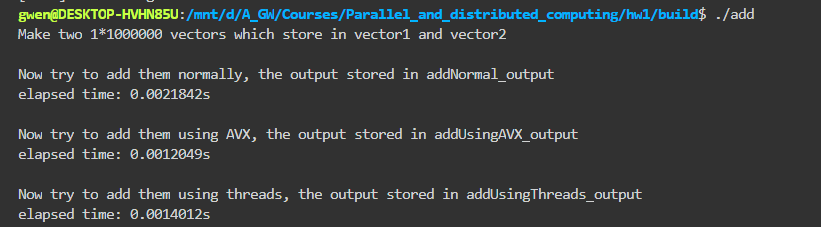

## homework 1

#### 题目

> 我们在第一次课程中已经降到，早期单节点计算系统并行的粒度分为：Bit级并
行，指令级并行和线程级并行。现代处理器如Intel、ARM、AMD、Power以及国
产CPU如华为鲲鹏等，均包含了并行指令集合，1.请调查这些处理器中的并行指
令集，并选择其中一种进行编程练习，计算两个各包含10^6个整数的向量之和。
2.此外，现代操作系统为了发挥多核的优势，支持多线程并行编程模型，请将问
题1用多线程的方式实现，线程实现的语言不限，可以是Java，也可以是
C/C++

#### 项目结构

```
.
├── CMakeLists.txt
├── include
│   ├── common.hpp
│   └── functions.hpp
├── lib
│   ├── addNormal.cpp //不用AVX和多线程下的向量加法
│   ├── addUsingAVX.cpp //使用AVX的向量加法
│   ├── addUsingThreads.cpp //使用多线程的向量加法
│   ├── CMakeLists.txt 
│   └── dataMaker.cpp //生成两个10^6的向量
├── README.md
└── src
    └── main.cpp
```

注：CMakeLists.txt中编译选项如下：

```makefile
set(CMAKE_CXX_FLAGS "${CMAKE_CXX_FLAGS} -pthread -mavx -mavx2 -O0")
```

#### 编译运行

```
mkdir build && cd build
cmake ..
make
./add
```

#### 输出结果示例

运行后，build子文件夹结构如下：
```
./build
├── add //项目可执行文件
├── addNormal_output //addNormal的结果输出
├── addUsingAVX_output  //addUsingAVX的结果输出
├── addUsingThreads_output //addUsingThreads的结果输出
├── CMakeCache.txt
├── CMakeFiles
├── cmake_install.cmake
├── lib
├── Makefile
├── vector1 //makeData生成的vector1
└── vector2 //makeData生成的vector2
```
可能的输出结果：



