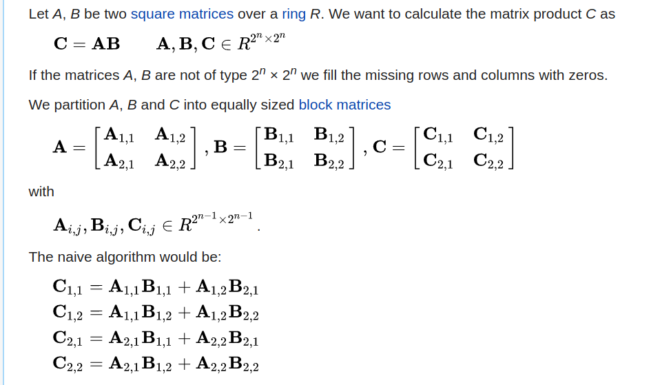
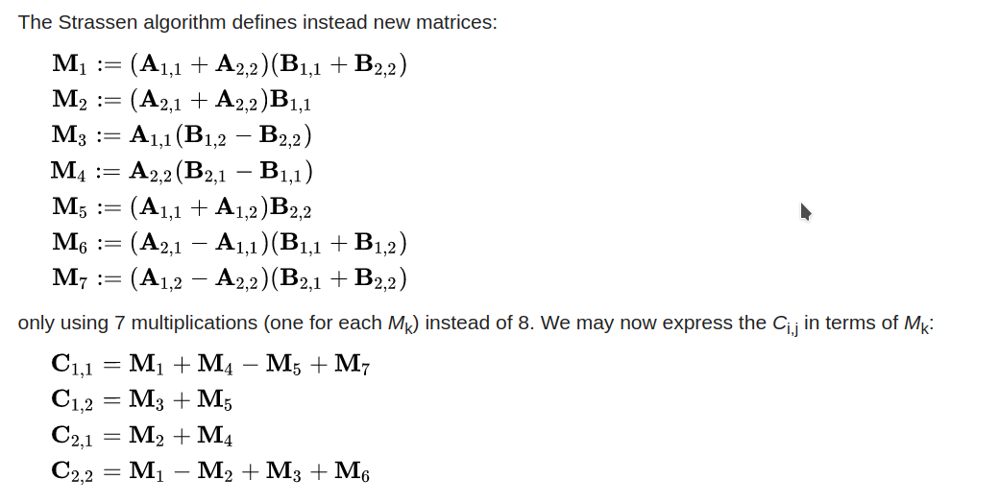

<center> <font size = 24>并行与分布式作业</font></center>

<center> <font size = 6>Homework-2</font></center>

<center> <font size = 6>第2次作业</font></center>


<center> <font size = 5>姓名：关雅雯</font></center>

<center> <font size = 5>班级：教务一班</font></center>

<center> <font size = 5>学号：18340045</font></center>


### 一、问题描述

1. 分别采用不同的算法（非分布式算法）例如一般算法、分治算法和Strassen算法等计算计
    算矩阵两个300x300的矩阵乘积，并通过Perf工具分别观察cache miss、CPI、 mem_load
    等性能指标。

2. Design an experiment (i.e., design and write programs and take measurements) to 
    determine the memory bandwidth of your computer and to estimate the caches at 
    various levels of the hierarchy. Use this experiment to estimate the bandwidth and L1 
    cache of your computer. Justify your answer. (Hint: To test bandwidth, you do not want 
    reuse. To test cache size, you want reuse to see the effect of the cache and to increase 
    this size until the reuse decreases sharply.) 
    （参考： https://www.e-learn.cn/topic/639863 ，
    https://stackoverflow.com/questions/48360238/how-can-the-l1-l2-l3-cpu-caches-be-turned-off-on-modern-x86-amd64-chips；关键寄存器:cr0，需要利用C和汇编的混合编程，选做）

3. Consider a memory system with a level 1 cache of 32 KB and DRAM of 512 MB with the 
    processor operating at 1 GHz. The latency to L1 cache is one cycle and the latency to DRAM 
    is 100 cycles. In each memory cycle, the processor fetches four words (cache line size is 
    four words). What is the peak achievable performance of a dot product of two vectors? Note: 
    Where necessary, assume an optimal cache placement policy. 

  ```c++
  /* dot product loop */
  for (i = 0; i < dim; i++)
  	dot_prod += a[i] * b[i];
  ```

4. Now consider the problem of multiplying a dense matrix with a vector using a two-loop 
    dot-product formulation. The matrix is of dimension 4K x 4K. (Each row of the matrix 
    takes 16 KB of storage.) What is the peak achievable performance of this technique using 
    a two- loop dot-product based matrix-vector product?

  ```c++
  for (i = 0; i < dim; i++)
  	for (j = 0; j < dim; j++)
  		c[i] += a[i][j] * b[j];
  ```

  

### 二、解决方案

文件结构：

```
.
├── cache_measure //测量cache
│   ├── main.cpp
│   └── measure
├── matrix_multiplication //矩阵乘法
│   ├── data //数据
│   │   └── matrix
│   ├── include
│   │   └── constant.hpp
│   └── src //源程序
│       ├── dataMaker.cpp //生成数据源文件
│       ├── mainDAG.cpp //分治法源文件
│       ├── mainNormal.cpp	//一般算法源文件
│       ├── mainStrassen_normal_ptr.cpp	//采用普通指针的Strassen算法源文件
│       ├── mainStrassen_shared_array.cpp //采用boost::shared_array的Strassen算法源文件
│       ├── run.sh	//编译脚本
│       ├── dag	//分治法可执行文件
│       ├── datamake //生成数据可执行文件
│       ├── normal	//一般算法可执行文件
│       └── str	//采用普通指针的Strassen算法可执行文件
├── memory-bandwidth-demo-master  //测量memory-bandwidth
│   ├── functions.c
│   ├── functions.h
│   ├── main.c
│   ├── Makefile
│   ├── memory_profiler
│   ├── monotonic_timer.c
│   ├── monotonic_timer.h
│   └── README.md
```


#### 问题一：矩阵乘法

分别采用一般方法、分治法、Strassen算法计算两个规模为$300\times300$的矩阵的乘积。

##### （1）一般方法

一般方法即通过三重循环计算矩阵乘积，复杂度为O($n^3$)

```c++
	for ( int i = 0; i < n; i++ )
		for ( int j = 0; j < n; j++ )
			for ( int k = 0; k < n; k++ )
				ans[ i ][ j ] += a[ i ][ k ] * b[ k ][ j ];
```


##### （2）分治法

分治原理如下：



其中，$A_{1.1},A_{1,2}$等8个子矩阵均用同样的方法分治解决。

对于任何$n \neq 2^k$的情况，根据
$$
\left\{
 \begin{matrix}
   A & 0 \\
   0 & 0 \\
  \end{matrix}
  \right\}
  \times
  \left\{
 \begin{matrix}
   B & 0 \\
   0 & 0 \\
  \end{matrix}
  \right\}
  =
    \left\{
 \begin{matrix}
   AB & 0 \\
   0 & 0 \\
  \end{matrix}
  \right\}
$$
通过添加0的方式使n增加为最接近的2的幂。

核心代码：

```c++
// a, b : two matrix. a: n * l; b: l * m
int** multDAG( int** a, int** b, int n, int l, int m ) {
	if ( n == 1 || l == 1 || m == 1 ) return mult( a, b, n, l, m );

	int** c = new int*[ n ];
	for ( int i = 0; i < n; i++ )
		c[ i ] = new int[ m ];

	int adjN = ( n >> 1 ) + ( n & 1 );
	int adjL = ( l >> 1 ) + ( l & 1 );
	int adjM = ( m >> 1 ) + ( m & 1 );
	
    //as、bs分别存储a、b划分成的四个子矩阵
	int**** as = divide4( a, adjN, adjL, n, l );
	int**** bs = divide4( b, adjL, adjM, l, m );

	int*** s = new int**[ 8 ];
	s[ 0 ] = multDAG( as[ 0 ][ 0 ], bs[ 0 ][ 0 ], adjN, adjL, adjM );
	s[ 1 ] = multDAG( as[ 0 ][ 1 ], bs[ 1 ][ 0 ], adjN, adjL, adjM );
	s[ 2 ] = multDAG( as[ 0 ][ 0 ], bs[ 0 ][ 1 ], adjN, adjL, adjM );
	s[ 3 ] = multDAG( as[ 0 ][ 1 ], bs[ 1 ][ 1 ], adjN, adjL, adjM );
	s[ 4 ] = multDAG( as[ 1 ][ 0 ], bs[ 0 ][ 0 ], adjN, adjL, adjM );
	s[ 5 ] = multDAG( as[ 1 ][ 1 ], bs[ 1 ][ 0 ], adjN, adjL, adjM );
	s[ 6 ] = multDAG( as[ 1 ][ 0 ], bs[ 0 ][ 1 ], adjN, adjL, adjM );
	s[ 7 ] = multDAG( as[ 1 ][ 1 ], bs[ 1 ][ 1 ], adjN, adjL, adjM );

	for ( int i = 0; i < adjN; i++ ) {
		for ( int j = 0; j < adjM; j++ ) {
			c[ i ][ j ] = s[ 0 ][ i ][ j ] + s[ 1 ][ i ][ j ];								
			if ( j + adjM < m ) c[ i ][ j + adjM ] = s[ 2 ][ i ][ j ] + s[ 3 ][ i ][ j ];	
			if ( i + adjN < n ) c[ i + adjN ][ j ] = s[ 4 ][ i ][ j ] + s[ 5 ][ i ][ j ];	
			if ( i + adjN < n && j + adjM < m ) c[ i + adjN ][ j + adjM ] = s[ 6 ][ i ][ j ] + s[ 7 ][ i ][ j ];  
		}
	}

	del_ab( as, adjN );
	del_ab( bs, adjL );
	del_s( s, adjN );

	return c;
}
```


##### （3）Strassen算法

在分治法对矩阵的划分的基础上，



通过减少矩阵乘法的次数，时间复杂度降至约为O($n^{2.8074}$)。

核心代码：

```c++
// a, b : two matrix. a: n * l; b: l * m
int** Strassen( int** a, int** b, int n, int l, int m ) {
	if ( n == 1 || l == 1 || m == 1 ) return mult( a, b, n, l, m );

	int** c = new int*[ n ];
	for ( int i = 0; i < n; i++ )
		c[ i ] = new int[ m ];

	int adjN = ( n >> 1 ) + ( n & 1 );
	int adjL = ( l >> 1 ) + ( l & 1 );
	int adjM = ( m >> 1 ) + ( m & 1 );

    //as、bs分别存储a、b划分成的四个子矩阵
	int**** as = divide4( a, adjN, adjL, n, l );
	int**** bs = divide4( b, adjL, adjM, l, m );

	int*** s = new int**[ 10 ];
	s[ 0 ] = add_and_minus( bs[ 0 ][ 1 ], bs[ 1 ][ 1 ], adjL, adjM, -1 );
	s[ 1 ] = add_and_minus( as[ 0 ][ 0 ], as[ 0 ][ 1 ], adjN, adjL, 1 );
	s[ 2 ] = add_and_minus( as[ 1 ][ 0 ], as[ 1 ][ 1 ], adjN, adjL, 1 );
	s[ 3 ] = add_and_minus( bs[ 1 ][ 0 ], bs[ 0 ][ 0 ], adjL, adjM, -1 );
	s[ 4 ] = add_and_minus( as[ 0 ][ 0 ], as[ 1 ][ 1 ], adjN, adjL, 1 );
	s[ 5 ] = add_and_minus( bs[ 0 ][ 0 ], bs[ 1 ][ 1 ], adjL, adjM, 1 );
	s[ 6 ] = add_and_minus( as[ 0 ][ 1 ], as[ 1 ][ 1 ], adjN, adjL, -1 );
	s[ 7 ] = add_and_minus( bs[ 1 ][ 0 ], bs[ 1 ][ 1 ], adjL, adjM, 1 );
	s[ 8 ] = add_and_minus( as[ 0 ][ 0 ], as[ 1 ][ 0 ], adjN, adjL, -1 );
	s[ 9 ] = add_and_minus( bs[ 0 ][ 0 ], bs[ 0 ][ 1 ], adjL, adjM, 1 );

	int*** M = new int**[ 7 ];
	M[ 0 ] = Strassen( as[ 0 ][ 0 ], s[ 0 ], adjN, adjL, adjM );
	M[ 1 ] = Strassen( s[ 1 ], bs[ 1 ][ 1 ], adjN, adjL, adjM );
	M[ 2 ] = Strassen( s[ 2 ], bs[ 0 ][ 0 ], adjN, adjL, adjM );
	M[ 3 ] = Strassen( as[ 1 ][ 1 ], s[ 3 ], adjN, adjL, adjM );
	M[ 4 ] = Strassen( s[ 4 ], s[ 5 ], adjN, adjL, adjM );
	M[ 5 ] = Strassen( s[ 6 ], s[ 7 ], adjN, adjL, adjM );
	M[ 6 ] = Strassen( s[ 8 ], s[ 9 ], adjN, adjL, adjM );

	for ( int i = 0; i < adjN; i++ ) {
		for ( int j = 0; j < adjM; j++ ) {
			c[ i ][ j ] = M[ 4 ][ i ][ j ] + M[ 3 ][ i ][ j ] - M[ 1 ][ i ][ j ] + M[ 5 ][ i ][ j ];
			if ( j + adjM < m ) c[ i ][ j + adjM ] = M[ 0 ][ i ][ j ] + M[ 1 ][ i ][ j ];
			if ( i + adjN < n ) c[ i + adjN ][ j ] = M[ 2 ][ i ][ j ] + M[ 3 ][ i ][ j ];
			if ( i + adjN < n && j + adjM < m ) c[ i + adjN ][ j + adjM ] = M[ 4 ][ i ][ j ] + M[ 0 ][ i ][ j ] - M[ 2 ][ i ][ j ] - M[ 6 ][ i ][ j ];
		}
	}

	del_ab( as, adjN );
	del_ab( bs, adjL );
	del_s( s, adjL, adjN );
	del_M( M, n );

	return c;
}
```


#### 问题二：测量memory bandwidth

Memory bandwidth is the rate at which data can be read from or stored into a semiconductor memory by a processor， 要测量memory bandwidth，我们要限定时间，看在该时间段内能访问的数据量。


为了解决这个问题，查询到资料[Achieving maximum memory bandwidth](http://codearcana.com/posts/2013/05/18/posts/2013/05/18/achieving-maximum-memory-bandwidth.html)。根据其做法，我们访问一个大数组，并记录时间，则$bandwidth = \frac{数据量}{时间}$ 。

此处我fork了该资料作者的程序https://github.com/awreece/memory-bandwidth-demo，并非我的代码，仅是学习了作者的探索过程。

该demo使用了多种方式来尝试确定最大的memory bandwidth，分别有：

- `read_memory_loop` does a simple `for (i = 0; i < size; *i++);`
- `read_memory_sse` uses SSE packed aligned loads to read 16 bytes at a time.
- `read_memory_avx` use AVX packed aligned stores to read 32 bytes at a time.
- `write_memory_loop` does a simple `for (i = 0; i < size; *i++ = 1);`
- `write_memory_rep_stosq` forces the use of the `rep stosq` instruction.
- `write_memory_sse` uses SSE packed aligned stores to write 16 bytes at a time.
- `write_memory_nontemporal_sse` uses nontemporal SSE packed aligned stores to write 16 bytes at a time and bypass the cache.
- `write_memory_avx` uses AVX packed aligned stores to write 32 bytes at a time.
- `write_memory_nontemporal_avx` uses nontemporal AVX packed aligned stores to write 32 bytes at a time and bypass the cache.
- `write_memory_memset` is merely a wrapper for `memset`.

从简单地读一个数组、写一个数组，到使用SIMD的指令（SSE、AVX）来一次访问更多的内存，但由于需要读取缓存行的原因，仍与理想bandwidth有较大差距。为了避免这一问题，该demo尝试使用了non-temporal的指令（不会读取缓存行然后再修改它，而是直接写入内存）。demo还尝试了使用重复的string操作。为了得到最大的width，使用了openMP来进行并行操作。


#### 问题三：

```c++
/* dot product loop */
for (i = 0; i < dim; i++)
	dot_prod += a[i] * b[i];
```


$i = 0$时，发生cache miss，进行了两次DRAM访问：第一次将a[0], a[1], a[2], a[3]加载到L1 cache，第二次将b[0], b[1], b[2], b[3]加载大L1 cache，用时$2 \times 100 = 200$ cycles。然后进行两次运算，+= 和 ×。

$i = 1, 2, 3$时，能直接从L1 cache访问数据，每次进行两次运算（+= 和 ×）。

此后如上循环。即：每进行8次操作（4次的+=和4次的×），用时200 cycles。

$time_{a\_cycle} = \frac{1}{1GHz} = 10^{-9}s$  

$ \frac{8}{200 \times 10^{-9}} = 4 \times 10^7 op/s = 40MFlops$


#### 问题四：

```c++
for (i = 0; i < dim; i++)
	for (j = 0; j < dim; j++)
		c[i] += a[i][j] * b[j];
```

$i = 0$时，b被遍历了一遍（被加载到了L1 cache中），由于b只占16KB空间，而L1 cache有32KB，而以后的循环也会一直访问b，基于最佳内存策略的假设，b会一直留在L1 cache中，不会再发生cache miss。

此后，同问题三类似，c会在每4×dim次循环中发生一次cache miss，a会在每4次循环中发生一次cache miss。由于dim足够大，可以忽略c的cache miss。

即：每4次循环，共8个操作，产生1次cache miss，共用时100 cycles。

$ \frac{8}{100 \times 10^{-9}} = 8 \times 10^7 op/s = 80MFlops$


### 三、实验结果

#### 问题一：矩阵乘法

由于本地运行perf stat -e mem-loads得0，根据https://stackoverflow.com/questions/44466697/perf-stat-does-not-count-memory-loads-but-counts-memory-stores，使用L1-dcache-loads、L1-dcache-stores代替。

分别对三个程序执行以下命令：

```bash
sudo perf stat exec_name
sudo perf stat -e cache-misses,cycles,instructions,mem-loads,L1-dcache-loads,L1-dcache-stores exec_name
```

##### (1) 一般算法

```bash
Performance counter stats for './normal':

            101.52 msec task-clock                #    0.995 CPUs utilized          
                10      context-switches          #    0.098 K/sec                  
                 0      cpu-migrations            #    0.000 K/sec                  
               480      page-faults               #    0.005 M/sec                  
       406,599,035      cycles                    #    4.005 GHz                    
     1,276,029,924      instructions              #    3.14  insn per cycle         
        84,393,839      branches                  #  831.275 M/sec                  
           221,118      branch-misses             #    0.26% of all branches        

       0.102016051 seconds time elapsed

       0.101800000 seconds user
       0.000000000 seconds sys


 Performance counter stats for './normal':

            99,006      cache-misses                                                
       406,323,199      cycles                                                      
     1,276,075,117      instructions              #    3.14  insn per cycle         
                 0      mem-loads    
       385,378,812      L1-dcache-loads
        75,972,149      L1-dcache-stores

       0.102713437 seconds time elapsed

       0.098685000 seconds user
       0.003947000 seconds sys
```


##### (2) 分治法

```bash
Performance counter stats for './dag':

         18,924.20 msec task-clock                #    1.000 CPUs utilized          
                74      context-switches          #    0.004 K/sec                  
                 0      cpu-migrations            #    0.000 K/sec                  
               888      page-faults               #    0.047 K/sec                  
    76,303,934,281      cycles                    #    4.032 GHz                    
   236,470,604,340      instructions              #    3.10  insn per cycle         
    49,336,787,276      branches                  # 2607.075 M/sec                  
        42,487,317      branch-misses             #    0.09% of all branches        

      18.926403032 seconds time elapsed

      18.924575000 seconds user
       0.000000000 seconds sys


 Performance counter stats for './dag':

           842,572      cache-misses                                                
    76,164,622,174      cycles                                                      
   236,470,340,258      instructions              #    3.10  insn per cycle         
                 0      mem-loads
    76,698,859,869      L1-dcache-loads
    27,452,766,440      L1-dcache-stores

      18.853909726 seconds time elapsed

      18.848389000 seconds user
       0.004000000 seconds sys
```


##### (3) Strassen算法

```bash
Performance counter stats for './str':

         11,140.89 msec task-clock                #    0.922 CPUs utilized          
                99      context-switches          #    0.009 K/sec                  
                 1      cpu-migrations            #    0.000 K/sec                  
         1,136,214      page-faults               #    0.102 M/sec                  
    44,336,857,468      cycles                    #    3.980 GHz                    
   123,063,842,716      instructions              #    2.78  insn per cycle         
    24,197,089,204      branches                  # 2171.917 M/sec                  
        20,689,299      branch-misses             #    0.09% of all branches        

      12.078778749 seconds time elapsed

      10.035370000 seconds user
       1.107489000 seconds sys
 
 Performance counter stats for './str':

        98,211,500      cache-misses                                                
    44,680,811,994      cycles                                                      
   123,360,949,447      instructions              #    2.76  insn per cycle         
                 0      mem-loads  
    36,833,688,768      L1-dcache-loads
    15,644,688,657      L1-dcache-stores

      16.478830359 seconds time elapsed

      10.050412000 seconds user
       1.304313000 seconds sys           
```


可见，在矩阵规模为$300\times300$的情况下，一般算法最快，Strassen其次，分治最慢。原因是分治法没有优化时间复杂度，同时动态数组消耗了大量时间；Strassen虽然矩阵乘法的时间复杂度有所降低，但n较小时优势并不明显，同时大量的动态数组让时间增加了。


#### 问题二：测量memory bandwidth

我的电脑有6个核心，此处是采用了4个线程的结果，结果会比最大memory bandwidth小。


### 四、遇到的问题及解决方法

这次实验中遇到了很多不懂的问题，也尝试了很多。

矩阵乘法中，为了让尽量使代码更清晰简洁，同时也方便内存管理，我尝试了用boost::shared_array来实现strassen算法，但是发现性能不如直接操作普通指针，最后还是采用了普通指针来创建动态数组的做法。当需要分割的矩阵的规模不是2的幂的时候，如何比较好地实现加0的做法也花了一些时间。

在测量内存带宽的时候，一开始并没有什么好的想法，只想到访问大数组并计算时间的方法，后来查阅了一些资料，最后学习了前文所述的资料中的探究过程。

