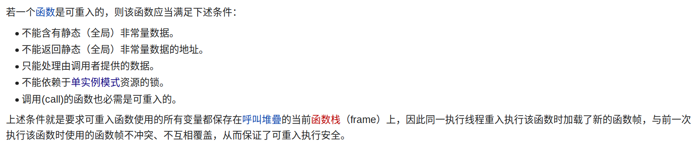
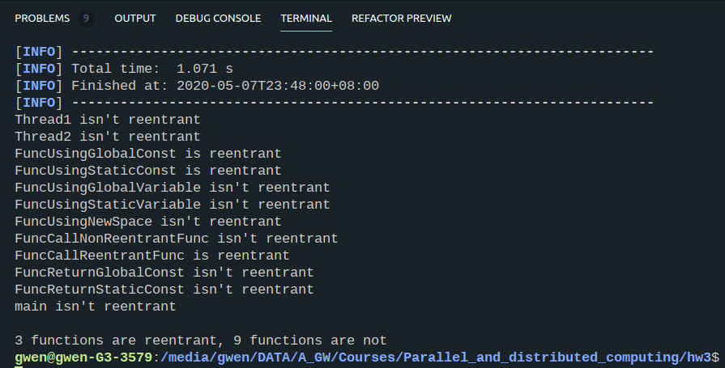

<center> <font size = 24>并行与分布式作业</font></center>

<center> <font size = 6>Homework-3</font></center>

<center> <font size = 6>第3次作业</font></center>


<center> <font size = 5>姓名：关雅雯</font></center>

<center> <font size = 5>班级：教务一班</font></center>

<center> <font size = 5>学号：18340045</font></center>


### 一、问题描述

```
利用LLVM (C、C++)或者Soot (Java)等工具检测多线程程序中潜在的数
据竞争以及是否存在不可重入函数,给出案例程序并提交分析报告。

参考:http://clang.llvm.org/docs/ThreadSanitizer.html
```


### 二、解决方案


#### 项目结构：

```c++
.
├── checkcode //用Java写、用Maven构建的程序，用于判断code中的多线程程序中的每一个函数是否可重入
│   ├── pom.xml
│   ├── src
│   │   └── main
│   │       └── java
│   │           └── com
│   │               └── Gw
│   │                   └── CheckService
│   │                       ├── CheckApp.java
│   │                       └── Check.java
│   └── target
│       └── CheckService-1.0-SNAPSHOT.jar
├── code //多线程程序存放处
│   ├── multithread
│   ├── multithread.bc
│   ├── multithread.c
│   ├── multithread.ll
│   ├── result.txt
│   └── run.sh
├── README.md
└── run.sh
```


#### 编译运行

运行项目根目录下的脚本run.sh即可

./run.sh 功能：调用./code文件夹下的run.sh，用maven构建checkcode中的程序，并执行该程序

```bash
cd code
bash ./run.sh 

cd ../checkcode
mvn clean package
java -jar ./target/CheckService-1.0-SNAPSHOT.jar < ../code/multithread.ll
```


./code/run.sh 功能：利用ThreadSanitizer对multithread.c进行分析，结果存放在result.txt中；并将multithread.c编译为IR code。

```bash
clang -fsanitize=thread -g -O1 multithread.c -o multithread
./multithread >result.txt  2>&1

clang multithread.c -emit-llvm -c -o multithread.bc
clang multithread.c -emit-llvm -S -c -o multithread.ll
```


#### 设计思路

##### （1）数据竞争

multithread中，有两个线程，它们在没有锁的情况下，对同一个全局变量进行读写，产生了数据竞争。

```c
int Global;
 
void *Thread1(void *x) {
    Global++;
    return NULL;
}
 
void *Thread2(void *x) {
    Global--;
    return NULL;
}

int main() {
    pthread_t t[2];
    pthread_create(&t[0], NULL, Thread1, NULL);
    pthread_create(&t[1], NULL, Thread2, NULL);
    pthread_join(t[0], NULL);
    pthread_join(t[1], NULL);
}
```

##### （2）判断函数是否可重入

wiki上对可重入的定义如下：



结合老师上课讲的内容，我用以下标准判断函数是否可重入：

|      | 条件                                                 |
| ---- | ---------------------------------------------------- |
| 1    | 不使用全局变量、静态变量（可使用全局常量、静态常量） |
| 2    | 不返回全局变量、静态变量的地址                       |
| 3    | 不调用不可重入函数                                   |
| 4    | 不使用malloc或new等开辟空间                          |

为此，我在multithread.c中增添了以下常量和函数：

```c
const int constGlobal = 10;

const char constChar[] = "content";

void *FuncUsingGlobalConst(void *x){//使用了全局常量，仍是可重入函数
    int tmp = constGlobal;
    char ch = constChar[0];
    return NULL;
}

void *FuncUsingStaticConst(void *x){//使用了静态常量，仍是可重入函数
    const static int sta = 0;
    return NULL;
}

int FuncUsingGlobalVariable(void *x){//使用了全局变量，不是可重入函数
    int tmp = Global;
    return tmp;
}

int FuncUsingStaticVariable(void *x){//使用了静态变量，不是可重入函数
    static int sta = 0;
    int tmp = sta;
    return tmp;
}

void *FuncUsingNewSpace(void *x){//开辟了新空间，不是可重入函数
    int *p = malloc(sizeof(int));
    return NULL;
}

void *FuncCallNonReentrantFunc(void *x){//调用了不可重入函数，不是可重入函数
    Thread1(NULL);
    return NULL;
}

void *FuncCallReentrantFunc(void *x){//只调用了可重入函数，仍是可重入函数
    FuncUsingGlobalConst(NULL);
    return NULL;
}

const char *FuncReturnGlobalConst(void *x){//返回了全局常量的地址，不是可重入函数
    return constChar;
}

const char *FuncReturnStaticConst(void *x){//返回了静态常量的地址，不是可重入函数
    const static char sta[] = "stacontent";
    return sta; 
}
```


LLVM IR 标识符有两种基本类型：

- 全局标识符（函数，全局变量）以’@’字符开头。
- 本地标识符（寄存器名称，类型）以’%’字符开头。

​	ll文件的全局变量、全局常量、静态变量、静态常量都会在ll文件的头部定义，且常量会在LLVM IR的运行时抢占说明符dso_preemptable或者dso_local后标注为constant。

```
@constGlobal = dso_local constant i32 10, align 4
@constChar = dso_local constant [8 x i8] c"content\00", align 1
@Global = common dso_local global i32 0, align 4
@FuncUsingStaticConst.sta = internal constant i32 0, align 4
@FuncUsingStaticVariable.sta = internal global i32 0, align 4
@FuncReturnStaticConst.sta = internal constant [11 x i8] c"stacontent\00", align 
```

​    对于某个具体的函数，如下面所示的FuncUsingStaticVariable，如果使用了@标识符的变量或常量，则要判断具体是变量还是常量；若是常量，需要判断函数是否返回了该全局或静态常量的地址；还要判断函数有没有调用任何不可重用函数、有没有利用malloc开辟新的空间。

```asm
define dso_local i32 @FuncUsingStaticVariable(i8*) #0 {
  %2 = alloca i8*, align 8
  %3 = alloca i32, align 4
  store i8* %0, i8** %2, align 8
  %4 = load i32, i32* @FuncUsingStaticVariable.sta, align 4
  store i32 %4, i32* %3, align 4
  %5 = load i32, i32* %3, align 4
  ret i32 %5
}
```


​	由于程序涉及大量的字符串操作，为了方便起见，我选择用java来实现这个程序，并利用maven将程序编译封装成jar文件。

​	核心代码如下：

```java
public void Initial() throws IOException {
        BufferedReader scanner = new BufferedReader(new InputStreamReader(System.in));
        try {
            String line = scanner.readLine();
            while (line != null) {
                if (line.startsWith("@"))
                    handleGlobal(line);
                else {
                    if (line.startsWith("define") == true) {
                        funcLineCnt = 1;
                        funcLine[0] = line;

                        while (true) {
                            line = scanner.readLine();
                            funcLine[funcLineCnt++] = line;
                            if (line.charAt(0) == '}')
                                break;
                        }
                        handleFunction();
                    }
                }
                line = scanner.readLine();

            }
        } catch (IOException e) {
            throw e;
        }
    }

    public void handleGlobal(String line) {
        String[] words = line.split("\\s");
        global[globalId] = words[0];
        isConst[globalId] = false;

        boolean pre = false;
        for (String word : words) {
            if (pre == true && word.compareTo("constant") == 0) {
                isConst[globalId] = true;
                break;
            }
            if (word.compareTo("dso_local") == 0 || word.compareTo("dso_preemptable") == 0) {
                pre = true;
            } else
                pre = false;
        }
        globalId++;
    }

    public String findFuncName(String line) {
        String[] words = line.split("(\\(|,|\\s)");
        for (String word : words) {
            if (word.startsWith("@"))
                return word;
        }
        return null;
    }

    public int isGlobal(String word) { // 0: no 1: const 2: variable
        for (int i = 0; i < globalId; i++) {
            if (word.compareTo(global[i]) == 0) {
                if (isConst[i] == true)
                    return 1;
                else
                    return 2;
            }
        }
        return 0;
    }

    public int findFuncId(String word) {
        for (int i = 0; i < funcId; i++) {
            if (word.compareTo(func[i]) == 0) {
                return i;
            }
        }
        return -1;
    }

    public boolean handleFunctionLine(String line) {// true:re false:non-re
        String[] words = line.split("(\\(|,|\\s)");
        boolean ret = false;
        for (String word : words) {
            if (word.compareTo("ret") == 0)
                ret = true;
            if (word.compareTo("@malloc") == 0)
                return false;
            if (word.startsWith("@")) {
                int res = isGlobal(word);
                if (res == 2)
                    return false;
                if (res == 1 && ret == true)
                    return false;
                if (res == 0) {
                    int id = findFuncId(word);
                    if (id != -1 && isReentrant[id] == false)
                        return false;
                }
            }
        }
        return true;
    }

    public void handleFunction() {
        func[funcId] = findFuncName(funcLine[0]);
        isReentrant[funcId] = true;

        for (int i = 0; i < funcLineCnt; i++) {
            if (handleFunctionLine(funcLine[i]) == false) {
                isReentrant[funcId] = false;
                break;
            }
        }
        funcId++;
    }
```


### 三、实验结果

（1）ThreadSanitizer的分析结果：指明了Thread1和Thread2同时对全局变量Global进行读写引发的数据竞争。

```bash
==================
WARNING: ThreadSanitizer: data race (pid=28516)
  Write of size 4 at 0x000000f122f8 by thread T2:
    #0 Thread2 /media/gwen/DATA/A_GW/Courses/Parallel_and_distributed_computing/hw3/code/multithread.c:17:11 (multithread+0x4b252d)

  Previous write of size 4 at 0x000000f122f8 by thread T1:
    #0 Thread1 /media/gwen/DATA/A_GW/Courses/Parallel_and_distributed_computing/hw3/code/multithread.c:12:11 (multithread+0x4b24fd)

  Location is global 'Global' of size 4 at 0x000000f122f8 (multithread+0x000000f122f8)

  Thread T2 (tid=28519, running) created by main thread at:
    #0 pthread_create <null> (multithread+0x423a8b)
    #1 main /media/gwen/DATA/A_GW/Courses/Parallel_and_distributed_computing/hw3/code/multithread.c:70:5 (multithread+0x4b26aa)

  Thread T1 (tid=28518, finished) created by main thread at:
    #0 pthread_create <null> (multithread+0x423a8b)
    #1 main /media/gwen/DATA/A_GW/Courses/Parallel_and_distributed_computing/hw3/code/multithread.c:69:5 (multithread+0x4b2694)

SUMMARY: ThreadSanitizer: data race /media/gwen/DATA/A_GW/Courses/Parallel_and_distributed_computing/hw3/code/multithread.c:17:11 in Thread2
==================
ThreadSanitizer: reported 1 warnings

```

（2）codecheck的运行结果



正确判断了每个函数是否可重入函数。


### 四、遇到的问题及解决方法

这次试验中遇到的问题就是对IR code的分析，由于此前我并不了解LLVM IR的语法，于是先根据官方的文档学习，然后再分析如何判断函数是否可重入。

在利用ThreadSanitizer进行分析多线程程序时，一开始我用的是c++的std::thread，由于用了std::thread编译成的IR code要远多于用c的线程调用生成的IR code，为了方便起见，我最后选择了用c来写这个多线程程序。

