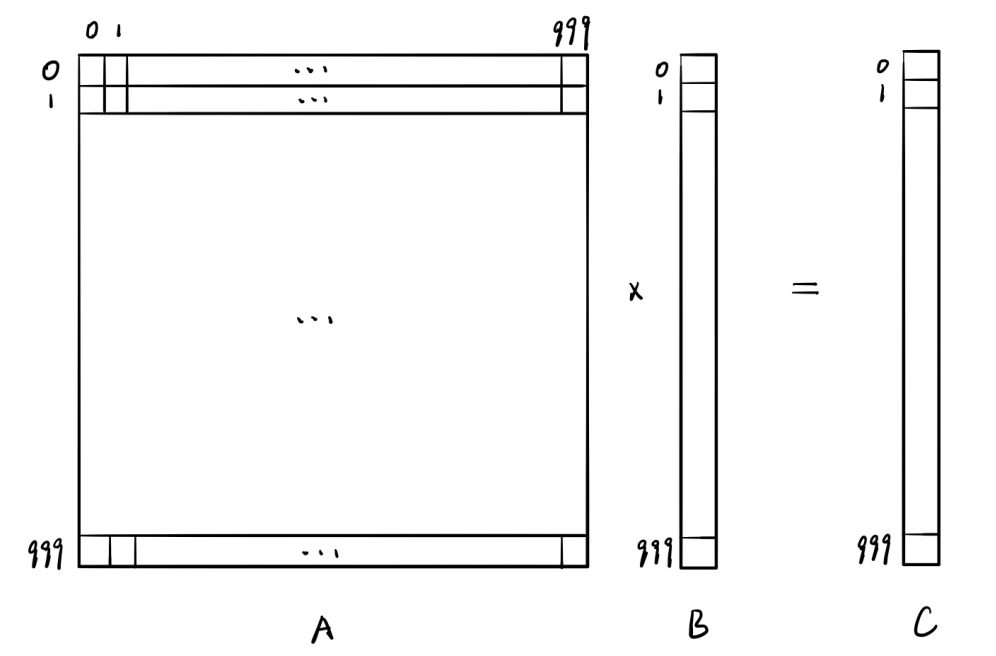
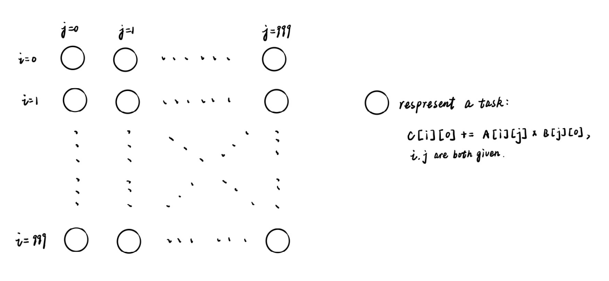
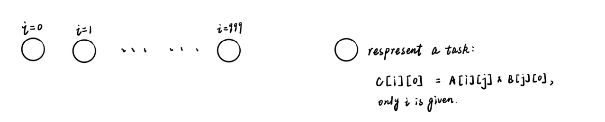
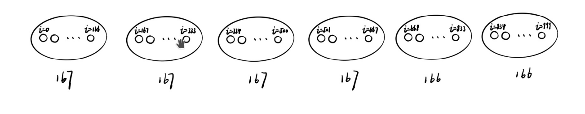
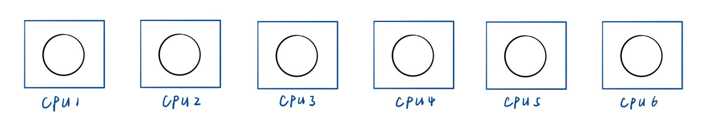

<center> <font size = 24>并行与分布式作业</font></center>

<center> <font size = 6>Homework-4</font></center>

<center> <font size = 6>第4次作业</font></center>


<center> <font size = 5>姓名：关雅雯</font></center>

<center> <font size = 5>班级：教务一班</font></center>

<center> <font size = 5>学号：18340045</font></center>


### 一、问题描述

```
利用 Foster并行程序设计方法计算1000x1000的矩阵与1000x1的向量之间的
乘积, 要求清晰地呈现 Foster 并行程序设计的四个步骤。
```


### 二、解决方案


#### 项目结构：

```c++
.
├── CMakeLists.txt
├── report //实验报告的markdown和图片
├── vecMul_Foster.cpp //使用Foster并行设计的程序
└── vecMul_Normal.cpp //朴素算法
```


#### 编译运行

```bash
mkdir build
cd build
cmake ..
make
./vecMul
```


#### 设计思路

##### (1) Partitioning

该两向量相乘，如下图所示：



朴素的做法是：

```c++
for(int i = 0; i < 1000; i ++)
	for(int j = 0; j < 1000; j ++)
		c[i] += a[i][j] * b[j];
```

那么可以按照Domain Partitioning，将给定i、j下, 

```
c[i] += a[i][j] + b[j]
```

作为一个task。




| CheckList                                                    |                                                              |
| ------------------------------------------------------------ | ------------------------------------------------------------ |
| At least 10x more primitive tasks than processors in target computer | 我的电脑上有6个CPU核心，原始任务共1000*1000个，远大于6       |
| Minimize redundant computations and redundant data storage   | 每个任务没有多余的计算，也没有需要使用local memory存储的数据，直接对global memory进行了简单的操作。 |
| Primitive tasks roughly the same size                        | 每一个原始任务的计算量都相同                                 |
| Number of tasks is an increasing function of problem size    | 按照这个方法，n×m的向量和m×1的向量相乘，任务数是n×m个，与问题规模正相关。 |


##### (2) Communication

在上述划分中，task之间不需要进行任何的通信，是一个非常理想的例子。

| CheckList                                                    |      |
| ------------------------------------------------------------ | ---- |
| Communication is the overhead of a parallel algorithm, we need to minimize it | √    |
| Communication operations balanced among tasks                | √    |
| Each task communicates with only small group of neighbors    | √    |
| Tasks can perform communications concurrently                | √    |
| Task can perform computations concurrently                   | √    |


##### (3) Agglomeration

原始任务：


将i相同的task归为一个task：



由于我的电脑共有6个CPU核心，1000/6 = 166.667，将task按下图归并：



最终归并成6个task。

| CheckList                                                    |                                                              |
| ------------------------------------------------------------ | ------------------------------------------------------------ |
| Locality of parallel algorithm has increased                 | 由上图可知，访问相近内存的任务被归并到一起，程序的局部性增强 |
| Replicated computations take less time than communications they replace | 此例子中不需要通信                                           |
| Data replication doesn’t affect scalability                  | 可扩展性并未受影响                                           |
| Agglomerated tasks have similar computational and communications costs | 归并后的任务依然是均衡的                                     |
| Number of tasks increases with problem size                  | 问题规模增大之后，会归并为更多的任务                         |
| Number of tasks suitable for likely target systems           | 6个任务，6个核心，是适合的                                   |
| Tradeoff between agglomeration and code modifications costs is reasonable | 需要修改的代码非常少                                         |

##### (4) Mapping



上图中的圆圈对应6个task，方框对应CPU核心。

由于实际的映射并非由程序员决定，所以具体的程序运行时的映射可能并非如此。


#### 代码设计

朴素算法实现在vecMul_Normal.cpp中

vecMul_Foster.cpp的核心代码如下：

```C++
thread *t[6];
int firstRow = 0;
for (int i = 0; i < 6; i++){
    int len = (i < 4) ? 167 : 166;
    t[i] = new thread{mulUnit, firstRow, firstRow + len};
    firstRow += len;
}
for (int i = 0; i < 6; i++){
    t[i]->join();
}
```

其中mulUnit函数对应每一个task：

```c++
void mulUnit(int st, int ed){
    for (int i = st; i < ed; i++)
        for (int j = 0; j < SIZE; j++)
            c[i] = a[i][j] * b[j];
}

```


### 三、实验结果


可以看到，使用Foster并行设计后的代码明显要更快，但是没有达到理想的加速比，分析应该是问题规模还不够大的原因。


### 四、遇到的问题及解决方法

这次实验总体比较顺利，遇到的问题不多，最主要的纠结的地方就是到底要怎么划分任务。重新回忆了课件上的几个例子，尝试了一下，发现由于向量乘法的例子比较特别，数据之间的依赖关系并不强，所以可以划分得完全不需要任务间通信的方案，于是决定就采用这个方法。

