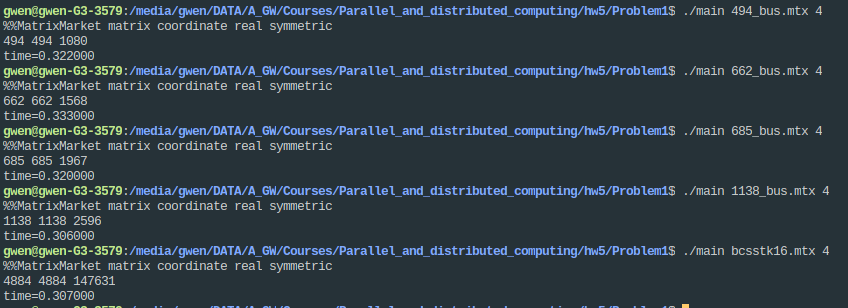
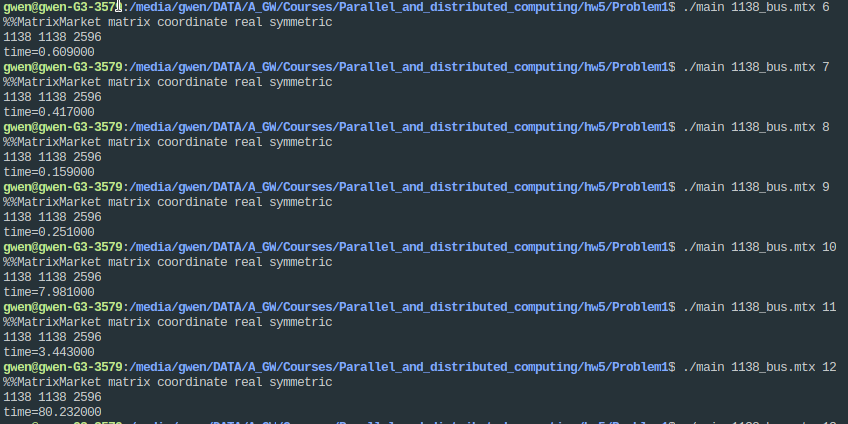
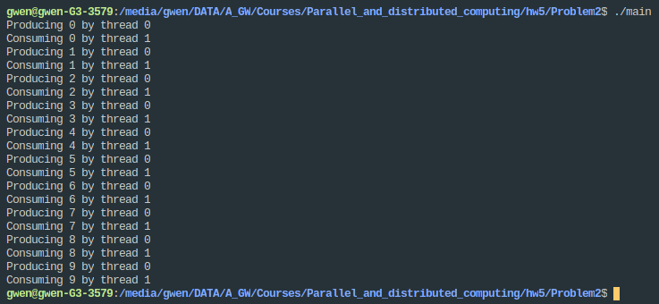
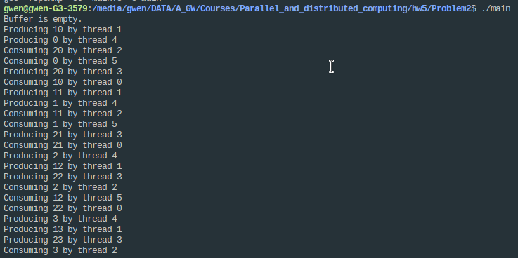
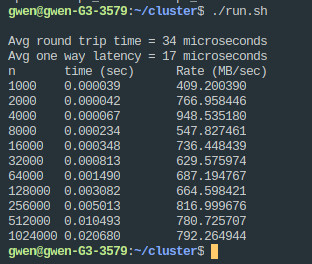

<center> <font size = 24>并行与分布式作业</font></center>

<center> <font size = 6>Homework-5</font></center>

<center> <font size = 6>第5次作业</font></center>


<center> <font size = 5>姓名：关雅雯</font></center>

<center> <font size = 5>班级：教务一班</font></center>

<center> <font size = 5>学号：18340045</font></center>


### 一、问题描述

```
1. Consider a sparse matrix stored in the compressed row format (you may find a description of this format on the web or any suitable text on sparse linear algebra). Write an OpenMP program for computing the product of this matrix
with a vector. Download sample matrices from the Matrix Market (http://math.nist.gov/MatrixMarket/) and test the performance of your implementation as a function of matrix size and number of threads.

2. Implement a producer-consumer framework in OpenMP using sections to create a single producer task and a single consumer task. Ensure appropriate synchronization using locks. Test your program for a varying number of producers and consumers.

3. 利用MPI通信程序测试本地进程以及远程进程之间的通信时延和带宽。
```


### 二、解决方案


#### Problem1：用OpenMP做稀疏矩阵向量乘法

##### 矩阵形式

采用**MatrixMarket matrix coordinate real symmetric**形式，即用记录矩阵中每一个非零项的值和坐标，形式如下：

```
%%MatrixMarket matrix coordinate real general
%=================================================================================
%
% This ASCII file represents a sparse MxN matrix with L 
% nonzeros in the following Matrix Market format:
%
% +----------------------------------------------+
% |%%MatrixMarket matrix coordinate real general | <--- header line
% |%                                             | <--+
% |% comments                                    |    |-- 0 or more comment lines
% |%                                             | <--+         
% |    M  N  L                                   | <--- rows, columns, entries
% |    I1  J1  A(I1, J1)                         | <--+
% |    I2  J2  A(I2, J2)                         |    |
% |    I3  J3  A(I3, J3)                         |    |-- L lines
% |        . . .                                 |    |
% |    IL JL  A(IL, JL)                          | <--+
% +----------------------------------------------+   
%
% Indices are 1-based, i.e. A(1,1) is the first element.
%
%=================================================================================
```

利用Matrix Market中提供的库mmic.h和mmic.c进行读入，采用网站上提供的sample input代码。

其中，

```
val[i]:第ｉ个非零项的值 
I[i]:第ｉ个非零项的行坐标
J[i]:第ｉ个非零项的列坐标
```


##### 并行方案

朴素的实现：

```c++
for(int i = 0; i < M; i++){
    for(int j = 0; j < N; j ++){
        ans[i] += matrix[i][j] * vector[j];
    }
}
```

由于直接记录了每一个非零项的值和坐标，所以上面的朴素实现变为：

```c++
for(int i = 0; i < nz; i++){//nz为非零项的个数
    ans[I[i]] += val[i] * vector[J[i]];
}
```

使用guided的调度，并行执行for循环。进行计时。

```c++
    clock_t start, end;
    start = clock();
#pragma omp parallel for num_threads(threadNum) schedule(guided)
    for (int i = 0; i < nz; i++) {
        ans[I[i]] += val[i] * vector[J[i]];
    }
    end = clock();
    printf("time=%f\n", ((double)end - start) / (CLOCKS_PER_SEC / 1000));
```


#### Problem2：生产者消费者模型

设计buffer的结构如下：

 ```c++
struct bufferStruct {
    int buf[SIZE];
    int head, tail, count;
} buffer;
 ```

buffer是一个环形缓冲区，head是下一个要读取的数据的位置，tail是下一个要写入的数据的位置，count表示当前的环形缓冲区内有多少个数据。

buffer的基本操作如下：

```c++
void init() {
    buffer.head = buffer.tail = buffer.count = 0;
}

int isfull() {
    return (buffer.count == SIZE);
}

int isempty() {
    return (buffer.count == 0);
}

int put(int tag) {//向环形缓冲区写入数据
    if (isfull()) return -1;
#pragma omp critical
    {
        buffer.buf[buffer.tail] = tag;
        buffer.tail = (buffer.tail + 1) % SIZE;
        buffer.count++;
    }
    return 1;
}

int get() {//从环形缓冲区读取数据
    if (isempty()) return -1;
    int tag;
#pragma omp critical
    {
        tag = buffer.buf[buffer.head];
        buffer.head = (buffer.head + 1) % SIZE;
        buffer.count--;
    }
    return tag;
}
```

设计生产者和消费者，生产者把[st, ed)的数据写入到buffer，消费者依次读取cnt个数据。

单一生产者和单一消费者：

```c++
#pragma omp parallel num_threads(2) 
    {
#pragma omp sections
        {
#pragma omp section
            producer(0, 10);
#pragma omp section
            consumer(10);
        }
    }
```

多个生产者和多个消费者（示例）：

```c++
#pragma omp parallel num_threads(6) 
    {
#pragma omp sections
        {
#pragma omp section
            producer(0, 10);
#pragma omp section
            producer(10, 20);
#pragma omp section
            producer(20, 30);
#pragma omp section
            consumer(10);
#pragma omp section
            consumer(10);
#pragma omp section
            consumer(10);
        }
    }
```


#### Problem3：利用MPI通信程序测试本地进程以及远程进程之间的通信时延和带宽

##### 搭建MPI环境

由于只有一台机器，所以使用了虚拟机来作为另一个节点，搭建了一个只有两个节点的mpi集群。搭建方法参考了下面这个链接：

https://wenku.baidu.com/view/85be4649a6c30c2259019ee9.html

##### 测试通信时延

创建两个进程，分别跑在本地节点跟虚拟机节点上。进程0开始计时，发送一个字节的消息给进程1，进程1接受消息，并且把该一个字节的消息返回给进程0，进程0接收到返回的消息后停止计时。由于消息只有一个字节，所以拷贝到缓存的时间可以忽略不计，中间经过的时间就是消息从进程0发送到进程1，再从进程1返回进程0的时间，也就是往返时间。则单程的时间为往返时间的一半。

由于只执行一次的时间误差可能很大，所以执行1000次，取平均值以减少误差。

进程0的代码如下：

```c
if (rank == 0) {
        dest = 1;
        source = 1;
        for (n = 1; n <= reps; n++) {
            T1 = MPI_Wtime();
            rc = MPI_Send(&msg, 1, MPI_BYTE, dest, tag, MPI_COMM_WORLD);
            if (rc != MPI_SUCCESS) {
                printf("Send error in task 0!\n");
                MPI_Abort(MPI_COMM_WORLD, rc);
                exit(1);
            }
            rc = MPI_Recv(&msg, 1, MPI_BYTE, source, tag, MPI_COMM_WORLD, &status);
            if (rc != MPI_SUCCESS) {
                printf("Receive error in task 0!\n");
                MPI_Abort(MPI_COMM_WORLD, rc);
                exit(1);
            }
            T2 = MPI_Wtime();

            deltaT = T2 - T1;
            sumT += deltaT;
        }
        avgT = (sumT * 1000000) / reps;
        printf("\nAvg round trip time = %d microseconds\n", avgT);
        printf("Avg one way latency = %d microseconds\n", avgT / 2);
    }
```

进程1的代码如下：

```c
else if (rank == 1) {
        dest = 0;
        source = 0;
        for (n = 1; n <= reps; n++) {
            rc = MPI_Recv(&msg, 1, MPI_BYTE, source, tag, MPI_COMM_WORLD, &status);
            if (rc != MPI_SUCCESS) {
                printf("Receive error in task 1!\n");
                MPI_Abort(MPI_COMM_WORLD, rc);
                exit(1);
            }
            rc = MPI_Send(&msg, 1, MPI_BYTE, dest, tag, MPI_COMM_WORLD);
            if (rc != MPI_SUCCESS) {
                printf("Send error in task 1!\n");
                MPI_Abort(MPI_COMM_WORLD, rc);
                exit(1);
            }
        }
    }
```

##### 测试带宽

进程0发送和接收n个double类型的数据给进程1，进程1也发送和接收n个double类型的数据给进程0。通过对进程0的发送和接收操作进行计时，从而计算带宽，带宽就是$\frac{2 \times n \times sizeof(double) \times 10^{-6}}{t}$MB/s。

使用MPI_Isend和MPI_Irecv进行测试，由于这两个函数是non-blocking的，需要用MPI_Waitall来等待两个操作执行完毕。

为了减少误差，对于每个n测试10次，取时间的最小值作为使用的时间。

```c
 for (int k = 0; k < NUMBER_OF_TESTS; k++) {
     if (rank == 0) {
         MPI_Sendrecv(MPI_BOTTOM, 0, MPI_INT, 1, 14,
                      MPI_BOTTOM, 0, MPI_INT, 1, 14, MPI_COMM_WORLD, &status);
         t1 = MPI_Wtime();
         MPI_Isend(sbuf, n, MPI_DOUBLE, 1, k, MPI_COMM_WORLD, &r[0]);
         MPI_Irecv(rbuf, n, MPI_DOUBLE, 1, k, MPI_COMM_WORLD, &r[1]);
         MPI_Waitall(2, r, statuses);
         t2 = MPI_Wtime() - t1;
         if (t2 < tmin) tmin = t2;
     } else if (rank == 1) {
         MPI_Sendrecv(MPI_BOTTOM, 0, MPI_INT, 0, 14,
                      MPI_BOTTOM, 0, MPI_INT, 0, 14, MPI_COMM_WORLD, &status);
         MPI_Irecv(rbuf, n, MPI_DOUBLE, 0, k, MPI_COMM_WORLD, &r[0]);
         MPI_Isend(sbuf, n, MPI_DOUBLE, 0, k, MPI_COMM_WORLD, &r[1]);
         MPI_Waitall(2, r, statuses);
     }
 }
```


### 三、实验结果


#### Problem1： 用OpenMP做稀疏矩阵向量乘法

##### （1）使用4个线程时，所用时间随矩阵规模的变化：



可以看到，一开始的矩阵规模为494*494，且有1080个非零项，后者同理。time为多线程计算矩阵向量乘法所用的毫秒数。

随着矩阵规模和非零项的同时增加，使用四个线程时，所用的时间近乎不变，甚至随着矩阵规模的增加而减少，原因是矩阵此时的矩阵规模比较小，随着矩阵规模的增大，线程的开销的占比逐渐减少，多线程带来的加速比更大，所以总时间反而随着任务的增加而减少了。


#####（2）所用时间随线程数量的变化：



可以看到，随着线程数量的增加，一开始所用的时间逐渐减少，在使用8个线程时到达最优，随后线程数量继续增加时，所用时间也增加了。原因是超过8个线程之后，线程的开销（创建线程和调度线程）的占比越来越大，当线程数量到达一定数目以后，线程的开销已经不可承受，使总时间大幅增加。


#### Problem2：生产者消费者模型

##### 单一生产者和单一消费者：




可以看到，thread 0为生产者线程，thread 1为消费者线程，生产者和消费者的运行是正确的，没有出现数据竞争问题。

##### 多个生产者和多个消费者：

三个生产者、三个消费者：生产者分别生产[0, 10), [10, 20), [20, 30)的数据，每个消费者消费10个数据。



由于输出太长，这里只截图一部分。一共分配了6个线程，分别对应3个生产者和3个消费者，为了让程序的性能更优，在不影响消费者读取数据的正确性的前提下，没有限制输出为临界区，所以输出顺序有一定的混乱（因为消费者获取了数据之后，并不是马上输出数据，中间有一定的时间，而这里就会有线程之间的争用，这对于消费者的正确性没有影响，只是会影响现在这样把结果输出调试的顺序）。可以看到消费者和生产者的运行是正确的。


#### Problem3：利用MPI通信程序测试本地进程以及远程进程之间的通信时延和带宽

通信带宽和时延的测试结果如下：




### 四、遇到的问题及解决方法

这次实验中遇到的最大的问题就是mpi集群的搭建，花了几乎一整天的时间。我用的是虚拟机，按照网上的教程搭建好后，一旦遇到跨节点的通信就会报错，为此花费了很长时间，我用的是mpich，尝试了把mpich换成openmpi、更新版本等操作，都没有找到错误的原因是什么，最后发现了如下一个问题解答：

```
If you have a machinefile with hostnames instead of ip-addresses and have the machines connected locally then you should have a nameserver running locally as well or else change the entries in your machine file to ip-address instead of hostnames. Having just /etc/hosts will not solve the issue.
```

我在etc/hosts中配置了两个节点的hostname、ip，在machinefile中使用的是hostname，由于是虚拟机所以也符合connected locally的条件，所以把machinefile中的hostname全部改成ip地址即可！