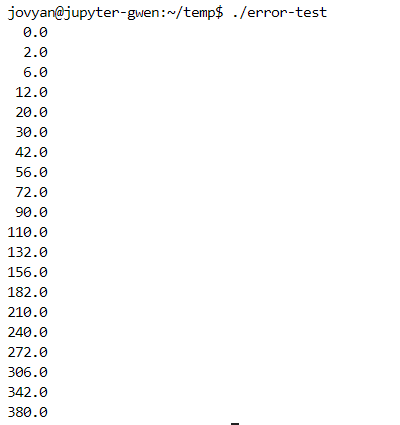
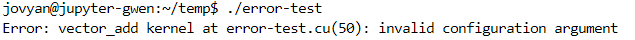
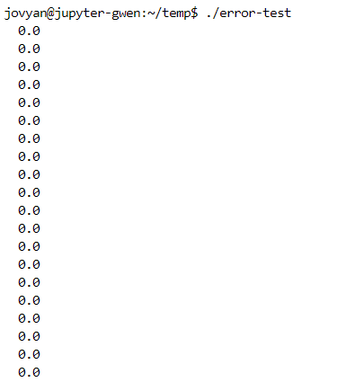
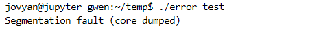
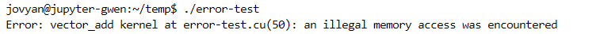
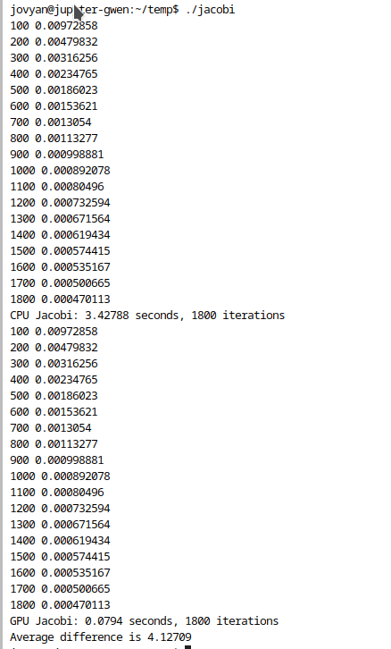
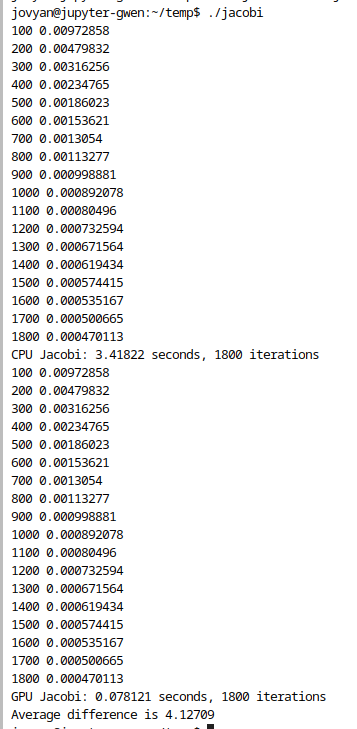
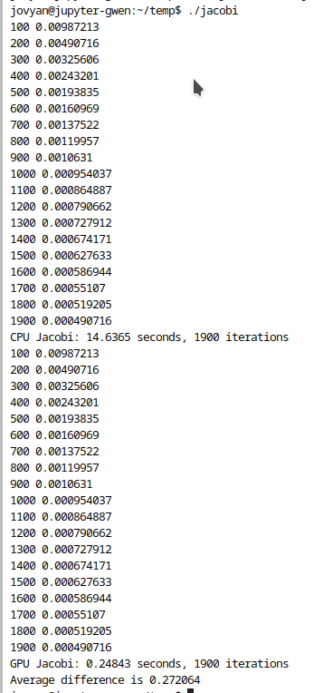

<center> <font size = 24>并行与分布式作业</font></center>

<center> <font size = 6>Homework-6</font></center>

<center> <font size = 6>第6次作业</font></center>


<center> <font size = 5>姓名：关雅雯</font></center>

<center> <font size = 5>班级：教务一班</font></center>

<center> <font size = 5>学号：18340045</font></center>


### 一、问题描述

#### CUDA-homework-1

Start from the provided skeleton code **error-test.cu** that provides some convenience macros for error checking. 

The macros are defined in the header file **error_checks_1.h**. 

Add the missing memory allocations and copies and the kernel launch and check that your code works. 

1. What happens if you try to launch kernel with too large block size? When do you catch the error if you remove the cudaDeviceSynchronize() call? 

2. What happens if you try to dereference a pointer to device memory in host code? 

3. What if you try to access host memory from the kernel? 

Remember that you can use also cuda-memcheck! If you have time, you can also check what happens if you remove all error checks and do the same tests again. 

#### CUDA-homework-2

In this exercise we will implement a Jacobi iteration which is a very simple finite-difference scheme. 

Familiarize yourself with the provided skeleton. Then implement following things: 

1. Write the missing CUDA kernel sweepGPU that implements the same algorithm as the sweepCPU function. Check that the reported averate difference is in the order of the numerical accuracy. 
2. Experiment with different grid and block sizes and compare the execution times.


### 二、解决方案

#### CUDA-homework-1

完善后的代码如下：

```c
//error-check.cu

#include <cstdio>
#include <cmath>
#include "error_checks.h" // Macros CUDA_CHECK and CHECK_ERROR_MSG

__global__ void vector_add(double *C, const double *A, const double *B, int N)
{
    // Add the kernel code
    int idx = blockIdx.x * blockDim.x + threadIdx.x;

    // Do not try to access past the allocated memory
    if (idx < N) {
        C[idx] = A[idx] + B[idx];
    }
}


int main(void)
{
    const int N = 20;
    const int ThreadsInBlock = 128;
    double *dA, *dB, *dC;
    double hA[N], hB[N], hC[N];
  
    for(int i = 0; i < N; ++i) {
        hA[i] = (double) i;
        hB[i] = (double) i * i;
    }

    /* 
       Add memory allocations and copies. Wrap your runtime function
       calls with CUDA_CHECK( ) macro
    */
    CUDA_CHECK( cudaMalloc((void**)&dA, sizeof(double)*N) );
    CUDA_CHECK( cudaMalloc((void**)&dB, sizeof(double)*N) );
    CUDA_CHECK( cudaMalloc((void**)&dC, sizeof(double)*N) );
    CUDA_CHECK( cudaMemcpy(dA, hA, sizeof(double) * N, cudaMemcpyHostToDevice));
    CUDA_CHECK( cudaMemcpy(dB, hB, sizeof(double) * N, cudaMemcpyHostToDevice));


    // Note the maximum size of threads in a block
    dim3 grid, threads;

    //// Add the kernel call here
    vector_add<<<1, ThreadsInBlock>>>(dC, dA, dB, N);

    // Here we add an explicit synchronization so that we catch errors
    // as early as possible. Don't do this in production code!
    cudaDeviceSynchronize();
    CHECK_ERROR_MSG("vector_add kernel");

    //// Copy back the results and free the device memory
    CUDA_CHECK( cudaMemcpy(hC, dC, sizeof(double) * N, cudaMemcpyDeviceToHost) );
    CUDA_CHECK( cudaFree(dA) );
    CUDA_CHECK( cudaFree(dB) );
    CUDA_CHECK( cudaFree(dC) );

    for (int i = 0; i < N; i++)
        printf("%5.1f\n", hC[i]);

    return 0;
}
```


#### CUDA-homework-2

完善后的代码如下：

```c
//jacobi.c

#include <sys/time.h>
#include <cstdio>
#include "jacobi.h"
#include "error_checks.h"

// Change this to 0 if CPU reference result is not needed
#define COMPUTE_CPU_REFERENCE 1
#define MAX_ITERATIONS 3000

// CPU kernel
void sweepCPU(double* phi, const double *phiPrev, const double *source, 
              double h2, int N)
{ 
    int i, j;
    int index, i1, i2, i3, i4;

    for (j = 1; j < N-1; j++) {
        for (i = 1; i < N-1; i++) {
            index = i + j*N; 
            i1 = (i-1) +   j   * N;
            i2 = (i+1) +   j   * N;
            i3 =   i   + (j-1) * N;
            i4 =   i   + (j+1) * N;
            phi[index] = 0.25 * (phiPrev[i1] + phiPrev[i2] + 
                                 phiPrev[i3] + phiPrev[i4] - 
                                 h2 * source[index]);
        } 
    }
} 

// GPU kernel
__global__ 
void sweepGPU(double *phi, const double *phiPrev, const double *source, 
              double h2, int N)
{
    // #error Add here the GPU version of the update routine (see sweepCPU above)
    int i = blockIdx.x * blockDim.x + threadIdx.x;
	int j = blockIdx.y * blockDim.y + threadIdx.y;
	if (i > 0 && j > 0 && i < N - 1 && j < N - 1)
	{
		int index = i + j * N;
		int i1 = (i - 1) + j * N;
		int i2 = (i + 1) + j * N;
		int i3 = i + (j - 1) * N;
		int i4 = i + (j + 1) * N;
		phi[index] = 0.25 * (phiPrev[i1] + phiPrev[i2] + phiPrev[i3] + phiPrev[i4] - h2 * source[index]);
	}
}


double compareArrays(const double *a, const double *b, int N)
{
    double error = 0.0;
    int i;
    for (i = 0; i < N*N; i++) {
        error += fabs(a[i] - b[i]);
    }
    return error/(N*N);
}


double diffCPU(const double *phi, const double *phiPrev, int N)
{
    int i;
    double sum = 0;
    double diffsum = 0;
    
    for (i = 0; i < N*N; i++) {
        diffsum += (phi[i] - phiPrev[i]) * (phi[i] - phiPrev[i]);
        sum += phi[i] * phi[i];
    }

    return sqrt(diffsum/sum);
}


int main() 
{ 
    timeval t1, t2; // Structs for timing
    const int N = 512;
    double h = 1.0 / (N - 1);
    int iterations;
    const double tolerance = 5e-4; // Stopping condition
    int i, j, index;

    const int blocksize = 16;
  
    double *phi      = new double[N*N]; 
    double *phiPrev  = new double[N*N]; 
    double *source   = new double[N*N]; 
    double *phi_cuda = new double[N*N]; 

    double *phi_d, *phiPrev_d, *source_d; 
    // Size of the arrays in bytes
    const int size = N*N*sizeof(double); 
    double diff;
  
    // Source initialization
    for (i = 0; i < N; i++) {
        for (j = 0; j < N; j++) {      
            double x, y;
            x = (i - N / 2) * h;
            y = (j - N / 2) * h;
            index = j + i * N;
            if (((x - 0.25) * (x - 0.25) + y * y) < 0.1 * 0.1)
                source[index] = 1e10*h*h;
            else if (((x + 0.25) * (x + 0.25) + y * y) < 0.1 * 0.1)
                source[index] = -1e10*h*h;
            else
                source[index] = 0.0;
        }            
    }

    CUDA_CHECK( cudaMalloc( (void**)&source_d, size) ); 
    CUDA_CHECK( cudaMemcpy(source_d, source, size, cudaMemcpyHostToDevice) ); 

    // Reset values to zero
    for (i = 0; i < N; i++) {
        for (j = 0; j < N; j++) {      
            index = j + i * N;
            phi[index] = 0.0; 
            phiPrev[index] = 0.0; 
        }            
    }

    CUDA_CHECK( cudaMalloc( (void**)&phi_d, size) ); 
    CUDA_CHECK( cudaMalloc( (void**)&phiPrev_d, size) ); 
    CUDA_CHECK( cudaMemcpy(phi_d, phi, size, cudaMemcpyHostToDevice) );
    CUDA_CHECK( cudaMemcpy(phiPrev_d, phiPrev, size, cudaMemcpyHostToDevice) );

    // CPU version 
    if(COMPUTE_CPU_REFERENCE) { 
        gettimeofday(&t1, NULL);

        // Do sweeps untill difference is under the tolerance
        diff = tolerance * 2;
        iterations = 0;
        while (diff > tolerance && iterations < MAX_ITERATIONS) {
            sweepCPU(phiPrev, phi, source, h * h, N);
            sweepCPU(phi, phiPrev, source, h * h, N);
            
            iterations += 2;
            if (iterations % 100 == 0) {
                diff = diffCPU(phi, phiPrev, N);
                printf("%d %g\n", iterations, diff);
            }
        }
        gettimeofday(&t2, NULL);
        printf("CPU Jacobi: %g seconds, %d iterations\n", 
               t2.tv_sec - t1.tv_sec + 
               (t2.tv_usec - t1.tv_usec) / 1.0e6, iterations);
    }

    // GPU version

    dim3 dimBlock(blocksize, blocksize); 
    dim3 dimGrid((N + blocksize - 1) / blocksize, (N + blocksize - 1) / blocksize); 
    
    //do sweeps until diff under tolerance
    diff = tolerance * 2;
    iterations = 0;

    gettimeofday(&t1, NULL);

    while (diff > tolerance && iterations < MAX_ITERATIONS) {
        // See above how the CPU update kernel is called
        // and implement similar calling sequence for the GPU code

        //// Add routines here
        // #error Add GPU kernel calls here (see CPU version above)
        sweepGPU<<<dimGrid, dimBlock>>>(phiPrev_d, phi_d, source_d, h * h, N);
		sweepGPU<<<dimGrid, dimBlock>>>(phi_d, phiPrev_d, source_d, h * h, N);

        iterations += 2;
        
        if (iterations % 100 == 0) {
            // diffGPU is defined in the header file, it uses
            // Thrust library for reduction computation
            diff = diffGPU<double>(phiPrev_d, phi_d, N);
            CHECK_ERROR_MSG("Difference computation");
            printf("%d %g\n", iterations, diff);
        }
    }
    
    //// Add here the routine to copy back the results
    // #error Copy back the results
    CUDA_CHECK(cudaMemcpy(phi, phi_d, size, cudaMemcpyDeviceToHost));
	CUDA_CHECK(cudaMemcpy(phiPrev, phiPrev_d, size, cudaMemcpyDeviceToHost));

    gettimeofday(&t2, NULL);
    printf("GPU Jacobi: %g seconds, %d iterations\n", 
           t2.tv_sec - t1.tv_sec + 
           (t2.tv_usec - t1.tv_usec) / 1.0e6, iterations);

    //// Add here the clean up code for all allocated CUDA resources
    // #error Add here the clean up code
    CUDA_CHECK(cudaFree(phi_d));
	CUDA_CHECK(cudaFree(phiPrev_d));
	CUDA_CHECK(cudaFree(source_d));   

    if (COMPUTE_CPU_REFERENCE) {
        printf("Average difference is %g\n", compareArrays(phi, phi_cuda, N));
    }
    
    delete[] phi; 
    delete[] phi_cuda;
    delete[] phiPrev; 
    delete[] source; 
    
    return EXIT_SUCCESS; 
} 
```


### 三、实验结果

#### CUDA-homework-1

完善代码后的运行结果：




1. What happens if you try to launch kernel with too large block size? 

   把常量ThreadsInBlock改成2050后，编译运行，出现以下报错：

   

   When do you catch the error if you remove the cudaDeviceSynchronize() call? 

   删除cudaDeviceSynchronize()的调用后，由于线程完成晚于输出，输出结果为：

   

2. What happens if you try to dereference a pointer to device memory in host code? 

   在host code中加入以下语句：

   ```c
   double var = dA[0];
   ```

   编译运行，结果为：

   

3. What if you try to access host memory from the kernel? 

   将vector_add函数修改为：

   ```c
   __global__ void vector_add(double *hA, double *C, const double *A, const double *B, int N)
   {
       // Add the kernel code
       int idx = blockIdx.x * blockDim.x + threadIdx.x;
   
       // Do not try to access past the allocated memory
       if (idx < N) {
           C[idx] = A[idx] + B[idx];
           printf("in kernel code: %lf\n", hA[idx]);
       }
   }
   ```

   其中hA是host code中的hA，访问的是host memory。

   编译运行，结果如下：

   


#### CUDA-homework-2

1. Write the missing CUDA kernel sweepGPU that implements the same algorithm as the sweepCPU function. Check that the reported averate difference is in the order of the numerical accuracy. 

   编译运行结果如下：

   

2. Experiment with different grid and block sizes and compare the execution times.

```bash
time ./jacobi
```

```c
const int N = 512;
const int blocksize = 16;
dim3 dimBlock(blocksize, blocksize); 
dim3 dimGrid((N + blocksize - 1) / blocksize, (N + blocksize - 1) / blocksize); 
```

N = 512, blocksize = 8：



N = 512, blocksize = 16时：


N = 512, blocksize = 32时：


N = 1024, blocksize = 8时：




### 四、遇到的问题及解决方法

这次实验是我第一次使用CUDA编程，我认为比较困难的地方在于数据的传递和线程的分配。一开始由于对CUDA线程模型里的坐标不熟悉，在CUDA-homework-2的GPU版本的sweep中弄错了分配的线程的坐标，导致debug了好一会才发现。

这次实验是在http://jupyterhub.vickytse.cn/上完成的，节省了搭建环境的时间，但是由于我的网络的问题，使用该远程资源的时候比较卡顿，反而导致了相当程度上效率的降低，应该在花费一定时间搭建本地环境与接受网络延迟中做一个平衡。